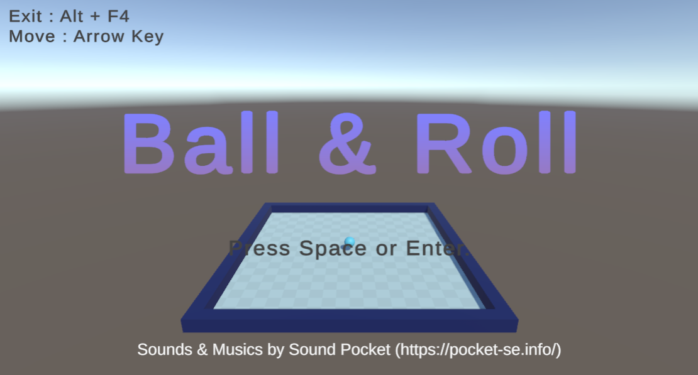
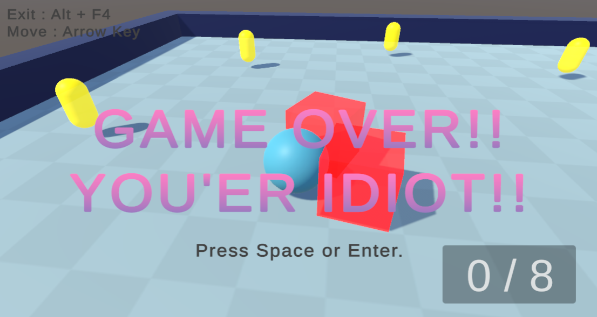
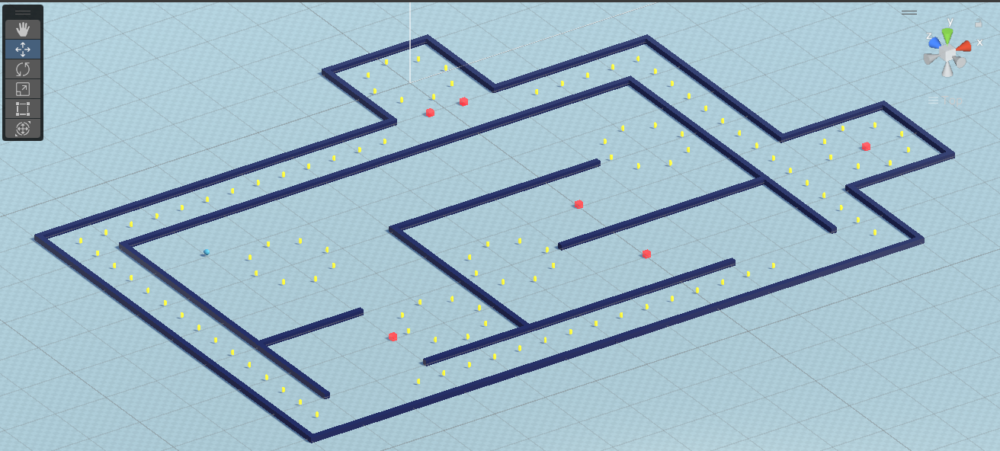

# Ball_KH_01
[https://github.com/unity3d-jp/FirstTutorial/wiki]

上のチュートリアルを元に、よりゲームらしく仕上げたUnityによるボール転がしゲームのデモです。

日本語によるコメントを記載しているので学習目的での利用が出来ると思います。

[https://github.com/hirohiroj3cub/Ball_KH_01/releases/tag/v1.00]

windows64bit環境なら、上記のリリースから実行ファイルをダウンロードできます。

・最新のバージョンに対応（UI-Text関連）

・より正しいUIの配置（Pivot,Anchorsの設定等）

・タイトル画面と複数のステージの遷移

・柔軟なカメラワーク

・簡単なAIを持った動く敵キャラ

・敵キャラAIのプレイヤー感知/追尾範囲

・ゲームオーバーとリトライの追加

・サウンドの追加

などの要素を新たに取り入れています。

# イメージ画像
・タイトル画面

・敵とゲームオーバー

・少し規模の大きなマップ
